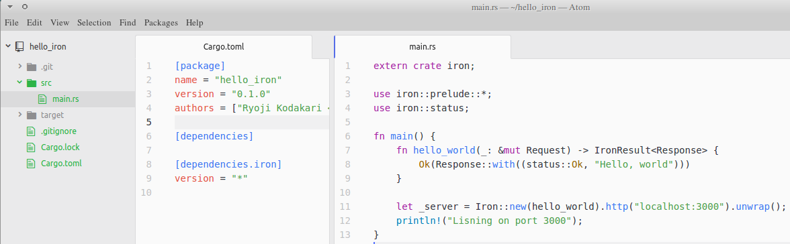
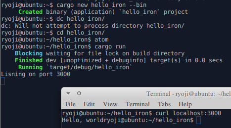
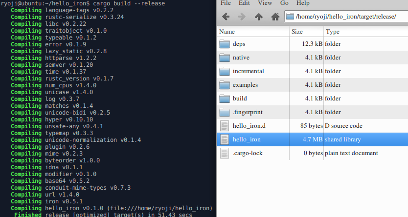

[RustでWebプログラミング No.1 ~ IronのインストールとHello World~ 20160922](http://poketo7878-dev.hatenablog.com/entry/2016/09/22/202953) より





[RustとAtom開発環境インストール(Linux)](http://tsrtesttest.appspot.com/wiki/Rust)

```
cargo build --release
```
[Cargoの使い方](http://keens.github.io/blog/2015/11/29/cargonotsukaikata/)

